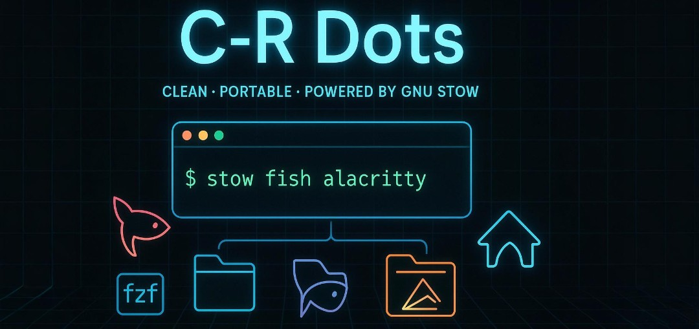

<div align="center">

*"Simplicity is the ultimate sophistication"* - Leonardo da Vinci

**[](https://github.com/Collins-Ruto/dotfiles)**

**[⭐ Star this repo](https://github.com/Collins-Ruto/dotfiles) • [⚠️ Report issues](https://github.com/Collins-Ruto/dotfiles/issues/new) • [𖣤 Suggest features](https://github.com/Collins-Ruto/dotfiles/issues/new)**

</div>

# 🖧 Dotfiles

> *A meticulously crafted command-line environment designed for efficiency and elegance*

## 🏛️ Architecture

<div align="center">

| Component | Choice | Purpose |
|-----------|--------|---------|
| **OS** | [Arch Linux](https://archlinux.org) | Rolling release, ultimate control |
| **WM** | [Hyprland](https://github.com/end-4/dots-hyprland) | Tiling window mananger. Initial config by [end-4](https://github.com/end-4) |
| **Shell** | [Fish](https://fishshell.com/) | Powerful, extensible terminal experience |
| **Multiplexer** | [Tmux](https://github.com/tmux/tmux) | Session management & workflow efficiency |

</div>

### ⚡ Key Features

- **[dots-hyprland](https://github.com/end-4/dots-hyprland)** - Base hyprland configuration and installation, recommended for first timers
- **🔍 Fuzzy Everything** - [fzf](https://github.com/junegunn/fzf) integration throughout the entire workflow
- **⌨️ Vim-Style Bindings** - Consistent modal interactions across all tools  
- **👽 Beautiful Prompt** - [Starship](https://github.com/starship/starship) delivers context-aware information
- **[𓄀 GNU Stow](https://www.gnu.org/software/stow/)** - Manage your dotfiles elegantly via symlinks

## ⚡ Quick Start

> [!Note]
> ⚠️ Please Back up your `.config/` folder or atleast affected files before proceeding.

```sh
# Clone the magic
git clone https://github.com/collins-ruto/dotfiles ~/.dotfiles

cd ~/.dotfiles

# Deploy with GNU Stow
stow fish alacritty  # Or customize

# Reload your shell and enjoy ✨
```

## 🛠 **Prerequisites**

### ⬇️ Install Stow

```sh
# Arch
sudo pacman -S stow
# Debian/Ubuntu
sudo apt install stow
# macOS
brew install stow
```

## 🗂 **Directory Structure**

Each folder in this repo (like `fish`, `kitty`, `hyprland`, etc.) contains a `.config/` or dotfile-style structure that mimics the expected paths under your `$HOME` directory. For example:

``` sh
alacritty/.config/alacritty/alacritty.yml  →  ~/.config/alacritty/alacritty.yml
fish/.config/fish/functions/               →  ~/.config/fish/functions/
home/.bashrc                               →  ~/.bashrc
```

This structure allows `stow` to place symlinks in the correct locations.

## 💻 **Core Commands**

### 💣 **Full Deployment**

Symlink everything from the root of this repo:

```sh
stow *  # Symlinks ALL configurations
```

#### ⛓️ **Selective Linking**

Link only specific tools from the root of this repo:

```sh
stow fish alacritty
```

Unlink a module:

```sh
stow -D starship
```

#### 👁️ **Dry Run Mode**

Preview changes before applying:

```sh
stow -nv fish
```

---

### ⚠️ **Special Cases & Gotchas**

#### 🖥️ Hyprland `hyprlock.conf` Warning for [dots-hyprland](https://github.com/end-4/dots-hyprland) users

Some scripts (e.g. `applycolor.sh`) generate or overwrite this file:

```sh
.config/hypr/hyprlock.conf
```

If you want a persistent custom configuration, **replace the template** used by the script at:

```sh
.config/ags/scripts/templates/hypr/hyprlock.conf
```

Otherwise, any changes will be lost on next theme or color update.

#### 🖥️ Changing the top bar border rounding / radius

Edit line 337 & 342 in, 
```
~/.config/ags/scss/_bar.scss
```

which is in the `.corner` (The top bar - bottom rounded edge) 
and `.corner-black` (The black rounded edge on the top and bottom corners) classes and contains @include large-rounding;

replace the two with something like `border-radius: 15px;`

### 🗑️ **Clean Removal**

---

To unlink everything:

```sh
stow -D *
```

To remove only one module:

```sh
stow -D fish
```


## 🪔 **Pro Tips**

### ♻️ Restow After Updates

Recreates broken or stale links:

```sh
stow --restow fish
```

#### 🛸 Backup Before Changes

Always make a backup before restowing:

```sh
cp -r ~/.config/fish ~/.config/fish.bak
```

#### ⚔️ Handle Conflicts

If links already exist:

```sh
stow --override=*  # Use carefully!
```

---

## 🌐 **Multi-Machine Setup**

### 1️⃣ Clone Repo

```sh
git clone https://github.com/yourname/dotfiles ~/.dotfiles
cd ~/.dotfiles
```

#### 2️⃣ Link Only What You Need

```sh
stow kitty fish tmux
```

Keep machine-specific configs minimal and modular.

---

### ❓ **Help & Reference**

```sh
stow --help | less
man stow
```
